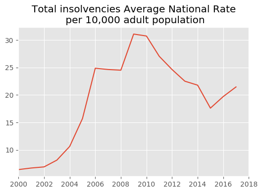
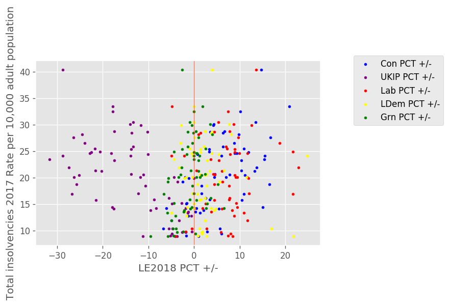
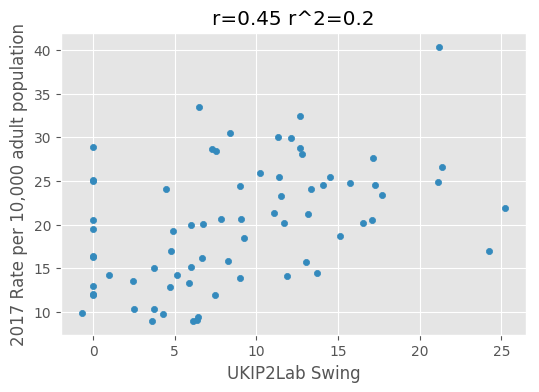

# Individual Insolvencies against Local Election 2018 in London

## Aims
* Try to link insolvencies with the 2018 Local General election results in London.
* Get experience with this kind of correlation task

## Data Used
* Insolvencies data: https://www.gov.uk/government/statistics/individual-insolvencies-by-location-age-and-gender-england-and-wales-2017

* LE2018 data: https://docs.google.com/spreadsheets/u/1/d/14GKPoj-E1CN0ZmiUd5gQWUi5zvGWbDoNoGT82RqKEno/edit?ts=5b07edf9#gid=0

## Results
Sanity check of the data:


Do some correlations for each party with the insolvency rate.



```
                      r       r^2
UKIP PCT +/-     -0.486734  0.236910
LDem PCT +/-     -0.299321  0.089593
Lab PCT +/-       0.137356  0.018867
Con PCT +/-       0.268314  0.071992
Grn PCT +/-       0.270829  0.073348
```

The collapse of UKIP is very evident in the data. This is an issue as places with high insolvency rates, often used to have a high UKIP vote share. Hence UKIP PCT +/- shows a big correlation with insolvency.

As a first step in removing the UKIP influence, we tried to look at swing:


